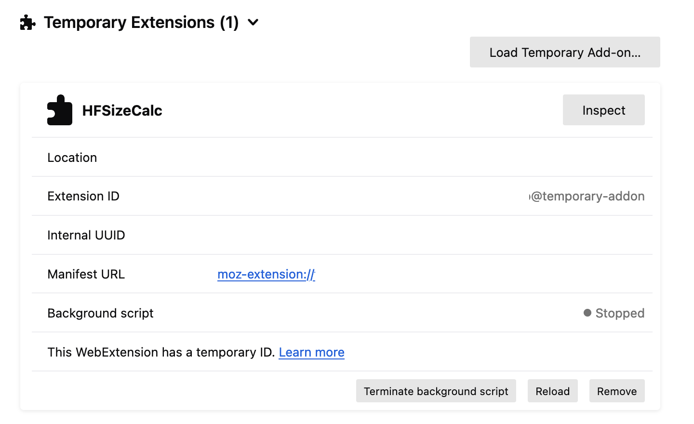

# HFSizeCalc-Firefox Extension

HFSizeCalc-Firefox is a Firefox browser extension based on [HFSizeCalc](https://github.com/vk-maurya/HFSizeCalc) that provides users with an easily digestible overview of the total weight file size for HuggingFace repos with safetensor models.

There are a few slight differences from [the original](https://github.com/vk-maurya/HFSizeCalc) to account for differences between `background.service_worker`/ `background.scripts` in [Manifest V3](https://blog.mozilla.org/addons/2024/03/13/manifest-v3-manifest-v2-march-2024-update/). 

## Installation (For Firefox)

1. Clone this repository to your local machine or download it as a ZIP archive and extract the files.
2. Open Firefox and navigate to `about:debugging` in the address bar.
3. Go to "This Firefox" on the left-hand side. 
4. Click "Load Temporary Add-On"

5. In the file dialog that appears, select the `HFSizeCalc` folder that you cloned or extracted earlier, and click on any file in the folder. 
6. HFSizeCalc-Firefox extension will be added to your Firefox as an unpacked extension.

## How to Use

Once the extension is installed, navigate to the Hugging Face repository page (e.g., https://huggingface.co/your_model_name). The extension will automatically display the total weight file size in the repo header.

## Contributing

Contributions are welcome to improve HFSizeCalc-Firefox. If you find any issues or have enhancement suggestions, please open an issue or submit a pull request.

